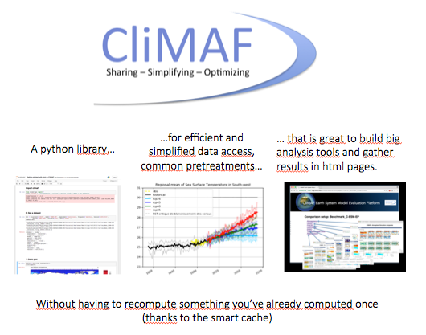
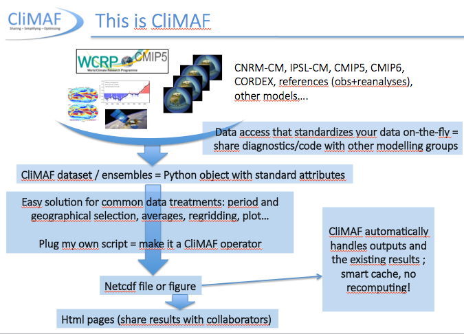

.. CliMAF documentation master file, created by
   sphinx-quickstart on Thu Nov  6 23:20:27 2014.
   You can adapt this file completely to your liking, but it should at least
   contain the root `toctree` directive.

Quick links : :ref:`News <news>` | :ref:`Functions <API>` |
:ref:`standard_operators` | :ref:`howto` | :ref:`examples` |  :ref:`contents`

|logo| 

CliMAF - a Climate Model Assessment Framework
========================================================

CliMAF is an `Open Source software
<http://en.wikipedia.org/wiki/Open-source_software>`_, distributed
with a GPL-compatible licence. See :doc:`the licence notice
<license>`. 
It is available at  `CliMAF GitHub repository <https://github.com/senesis/climaf>`_

The goal of CliMAF is to ease the common steps that separate you from your scientific diagnostic (in climate science):
CliMAF was designed to answer those specifications of CliMAF:
  - We have **several data organizations (path/filename syntax, variable names, units... CMIP5 and CMIP6 at CLIMERI among others)** to deal with and **we don’t want to rewrite all of them**
  - We want to **share diagnostics**: one common library with a vocabulary **that follows standards (inspired by the CMIP standards)**
  - We don’t want to exclude existing scripts: **possibility to plug any script** that can be run with a command line, **your own** post-processing and analysis **scripts and programs** as well as other tools sets such as `NCO <http://nco.sourceforge.net/>`_ and `CDO <https://code.zmaw.de/projects/cdo/embedded/1.6.4/cdo.html>`_  operators
  - We want to **ease all those classic/basic treatments we do everyday**: selection of a period, variable, geographical region, working on an ensemble
  - We don’t want to **recompute what has already been computed once**
  - We want to use this library to build a **custom set of diagnostics** as well as a **big evaluation package** like the `CliMAF Earth System Model Evaluation Platform <https://github.com/jservonnat/C-ESM-EP/wiki>`_

Can CliMAF make my scientific life easier?
----------------------------------------------

You want to know what CliMAF is about? Here are some notebooks to illustrate interesting things to do with it:
 - :download:`CliMAF in a nutshell <../examples/CliMAF_in_a_nutshell.html>` : a quick overview of what CliMAF is about: data access, the cache, quick pretreatments and plots
 - :download:`Adding access to my own datasets <../examples/Adding_access_to_my_own_data.html>` : see how you can access your own data in CliMAF, taking advantage of the period/variable/geographical region selection provided by ds() (and many other advantages) ; see also how to access an isolated file (like a grid or mask file)
 - :download:`How the cache works and how to manage its content <../examples/Managing_your_cache_in_CliMAF.html>`
 - :download:`Getting started with plot() <../examples/Getting-started-with-plot-in-CliMAF.html>` : some illustrations of the main features of the CliMAF plot operator (:doc:`scripts/plot`) to find out quickly how you can do some of the maps we like to do in climate science 
 - :download:`gathering my results in an html page <../examples/Gathering_my_results_in_an_html_page.html>`
 - or :download:`the most common operators for pretreatments and the basis of how to plug a script <../examples/Main_operators_and_how_to_plug_your_script.html>`

The links point to the html versions of the notebooks.

You can get the original notebooks (.ipynb) in :ref:`examples`. 

Have a look at `this documentation <https://post2web.github.io/posts/reuse-jupyter-notebooks/>`_  to see how to reuse a notebook from a python script (and avoid the conversion from the notebook to python script).

CMIP6/CMIP5 CLIMERI - Convergence training session November 19 2018
--------------------------------------------------------------------
These are the notebooks used for the `training session of November 19 (2018) on 'CMIP6 analysis at CLIMERI' <http://convergence-ipsl.prod.lamp.cnrs.fr/data-analysis/>`_ (follow the link to see how to set up your environment to work with CliMAF at CLIMERI).
Morning presentation:
 - :download:`a quick illustration of CMIP data access on Ciclad - CLIMERI <../examples/CLIMERI_Quick_demo_CMIP_data_access_20181119.html>`

Afternoon practicals:
 - 1/ :download:`Access CMIP data, observations/reanalyses, and explore the archives (on Ciclad - CLIMERI) <../examples/Basis_of_CliMAF_data_access_at_CLIMERI.html>`_
 - 2/ :download:`work with ensembles (CMIP, CORDEX, or any other ensembles specified manually) <../examples/Working_with_CliMAF_ensembles.html>`_
 - 3/ Open session on available functionalities in the notebooks (general sujects above: :download:`Getting started with plot() <../examples/Getting-started-with-plot-in-CliMAF.html>`_, :download:`the most common operators for pretreatments and the basis of how to plug a script <../examples/Main_operators_and_how_to_plug_your_script.html>`_, or :download:`gathering my results in an html page <../examples/Gathering_my_results_in_an_html_page.html>`_)

FAQ (Frequently Asked Questions)
--------------------------------------------------------------------
TBD, with your feedbacks.

We need you for this! please send your questions at: climaf@meteo.fr

Another way to describe CliMAF
--------------------------------

CliMAF is basically a Python-scriptable way to process NetCDF `CF compliant <http://cfconventions.org/>`_ climate model outputs which allows:

- to almost *forget about accessing input data* : you refer to
  'variables' in 'simulations', CliMAF knows a bunch of data
  organization schemes, you just quote some root locations, usually in
  configuration files ; [ under development : data can also be on the
  `ESGF <http://esgf.llnl.gov/>`_ ] 
- **to apply diagnostics (i.e. any post-processing module) coded in
  any langage**, provided they meet very minimal requirements, such as
  described in section :ref:`operators` ;  they can be :

  - either binaries, which accepts command-line arguments, read NetCDF
    files, and output NetCDF files or graphics (yet only in PNG format)
  - or Python function which accept Masked Arrays data structure as inputs and outputs

- to easily **pipe and combine such diagnostic** binaries or functions
- to describe the piping using Python scripting, thus building formal
  expressions in a simple syntax (called **CRS** for CliMAF Reference Syntax) 
- to trigger CRS expression computation only once needed
- to handle a cache of results, which access keys are CRS expressions

A very low-profile knowledge of Python is enough to take full advantage of CliMAF

Documentation
----------------

An overview of basic tasks is provided by :ref:`the first items of the howto section <howto>`

A top level table of contents show below, and a full one at :ref:`contents`

There are also some direct access tools : :ref:`search`, :ref:`genindex` , :ref:`modindex`

Content
----------

See the full, extended table at :ref:`contents`

.. _mastertoc:

.. toctree::
   :maxdepth: 1

   license
   requirements
   installing
   examples
   operators
   std_operators
   known_data
   API
   howto
   experts_corner
   contributing
   news
   future_steps
   community

