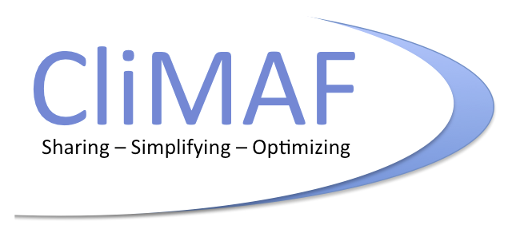

.. CliMAF documentation master file, created by
   sphinx-quickstart on Thu Nov  6 23:20:27 2014.
   You can adapt this file completely to your liking, but it should at least
   contain the root `toctree` directive.

Quick links : :ref:`News <news>` | :ref:`Functions <API>` |
:ref:`standard_operators` | :ref:`howto` | :ref:`examples` |  :ref:`contents`

|logo| 

CliMAF - a Climate Model Assessment Framework
========================================================

CliMAF is an `Open Source software
<http://en.wikipedia.org/wiki/Open-source_software>`_, distributed
with a GPL-compatible licence. See :doc:`the licence notice
<license>`. 
It is available at  `CliMAF GitHub repository <https://github.com/senesis/climaf>`_

The aim of CliMAF is to allow for an actual, **easy, collaborative development of climate model outputs assessment suites by climate scientists with varied IT background**, and to ultimately share such suites for the benefit of the Climate Science. 

So, CliMAF can be described as :

- an aid for handling access to common climate
  simulations and re-analysis datafiles, and to personnal data
  files, in a uniform way
- a wrapper which provides you with uniform, handy, combination and caching
  features around :

  - **your own** post-processing and analysis **scripts and programs**
  - other tools sets such as `NCO <http://nco.sourceforge.net/>`_ and `CDO <https://code.zmaw.de/projects/cdo/embedded/1.6.4/cdo.html>`_  operators

- a way to share advanced climate diagnostic modules 
- an actual repository for such modules
- and a visualisation engine for the corresponding results

Can CliMAF make my scientific life easier?
----------------------------------------------

In the following you will find illustrations of the use of CliMAF:
- CliMAF in a nutshell: a quick overview of what it does and how to use it
- access CMIP data, observations/reanalyses, and explore the archives (on Ciclad - CLIMERI)
- work with ensembles
- gathering my results in an html page

You will also find notebooks to illustrate various aspects of CliMAF:
- how to use the plot operator
- how the cache works
- details on the common pretreatments
- or how to plug a script

Examples of what CliMAF can do
-----------------------------------

Use it to do all the pretreatments on a CMIP archive and then do the plot with your own script:

Building a community tool to be used routinely, producing loads of figures: The CliMAF Earth System Model Evaluation Platform (C-ESM-EP):

Description 
----------------

CliMAF is basically a Python-scriptable way to process NetCDF `CF compliant <http://cfconventions.org/>`_ climate model outputs which allows:

- to almost *forget about accessing input data* : you refer to
  'variables' in 'simulations', CliMAF knows a bunch of data
  organization schemes, you just quote some root locations, usually in
  configuration files ; [ under development : data can also be on the
  `ESGF <http://esgf.llnl.gov/>`_ ] 
- **to apply diagnostics (i.e. any post-processing module) coded in
  any langage**, provided they meet very minimal requirements, such as
  described in section :ref:`operators` ;  they can be :

  - either binaries, which accepts command-line arguments, read NetCDF
    files, and output NetCDF files or graphics (yet only in PNG format)
  - or Python function which accept Masked Arrays data structure as inputs and outputs

- to easily **pipe and combine such diagnostic** binaries or functions
- to describe the piping using Python scripting, thus building formal
  expressions in a simple syntax (called **CRS** for CliMAF Reference Syntax) 
- to trigger CRS expression computation only once needed
- to handle a cache of results, which access keys are CRS expressions

A very low-profile knowledge of Python is enough to take full advantage of CliMAF

Documentation
----------------

An overview of basic tasks is provided by :ref:`the first items of the howto section <howto>`

A top level table of contents show below, and a full one at :ref:`contents`

There are also some direct access tools : :ref:`search`, :ref:`genindex` , :ref:`modindex`

Content
----------

See the full, extended table at :ref:`contents`

.. _mastertoc:

.. toctree::
   :maxdepth: 1

   license
   requirements
   installing
   examples
   operators
   std_operators
   known_data
   API
   howto
   experts_corner
   contributing
   news
   future_steps
   community

