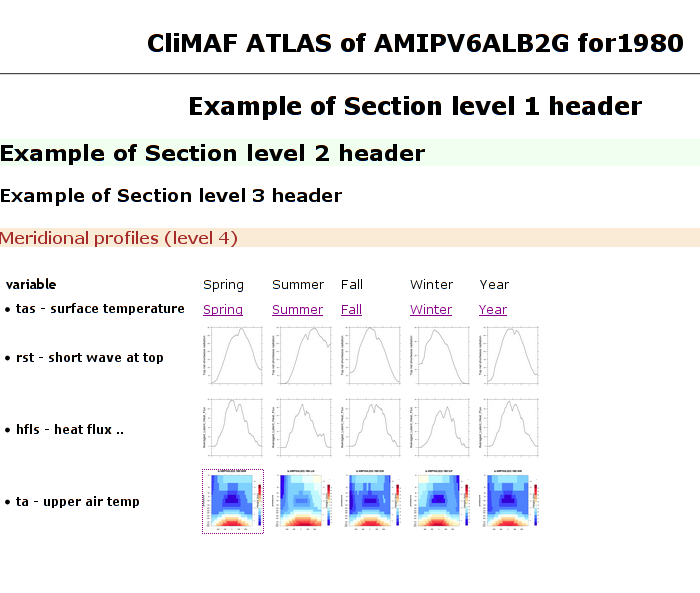

.. _news:

------------
What's new
------------

Changes, newest first:

- V2.0.2:

  - CliMAF can **call ESMValTool diagnostic scripts**, feeding them with data accessed and pre-processed by CliMAF calls. See :doc:`esmvaltool`

  - **The computation cost for all objects is now handled**, and can
    be queried, using function :py:func:`~climaf.cache.ccost`. Cost is
    expressed as elapsed time. For getting the cost of a scalar, call
    :py:func:`~climaf.driver.cvalue` with argument``cost=True``

  - cache:

    - Two bugs related to cache were fixed : cache content was not
      updated on exit, and with Python 3, it was not read at
      startup. Errors related to reading / writing cache are no more
      hidden.
    - The following cache variables are now handled in env.environment module: currentCache, cachedirs, indexFileName

  - Fix `issue 193<https://github.com/rigoudyg/climaf/issues/193>` regarding behaviour of listfiles
    for ambiguous cases

  - **Finding CMIP6 datasets is optimized when facets/attributes have shell-like wildcards** ( * or ?):

    - This relies on building tables that allows to derive wildcard
      facet's list of values by using other facet's value. Building
      the table may take a while, but the table is saved for further
      sessions (in the cache).
    - Also, an incremental testing of all possible data paths (built
      with possible facet values) allows to avoid costly glob.glob
      operations.
    - As an example, searching CMIP6 'tos' data for expermient
      historical and all models, realizations, and grids (and not for
      peridos) takes 77 seconds on Ciclad;  searching also for
      all periods takes 20 minutes, instead of 37 minutes.
    - This is yet limited to CMIP6 data, and active unless you set
      env.optimize_cmip6_wildcards to False
    - See module documentation for :py:mod:`~climaf.projects.optimize`

  - **New dataset's method glob is proposed as a replacement for
    method explore**. It may be of simpler use, as it can return a list
    of all facets value combinations that match data. See
    :py:func:`~climaf.classes.cdataset.glob()`.

- V2.0.1:

  - **Scripts can now process multiple ensembles, and ensembles which are not the first argument**:

    - Each ensemble argument will be replaced by the list of files corresponding to the ensemble,
      each list being ordered by the ensemble order (see :py:func:`~climaf.classes.cens`);
      unless intentionally, the order is the same among all ensembles (if they are indexed by
      the same list of member labels)

- V2.0.0:

  - **Python 3 compatibility**:

    - This new version is fully compatible with both python2 and python3.
      It has been tested with python 2.7 and python 3.7.
      Tests with other versions will come soon.

  - **Scalar values computed using** :py:func:`~climaf.driver.cvalue` **are now cached**; users can reset the
    corresponding in-memory and disk caches (both together) using :py:func:`~climaf.cache.raz_cvalues`.
    Variable :py:data:`cache.handle_cvalues` allows (when set to False) to de-activate this cache.

    .. note::
       function :py:func:`~climaf.driver.cvalue` now returns a Python float (instead of a numpy.float64)

    - Internals:

      - this uses an in-memory dict (:py:data:`~climaf.cache.cvalues`) and a Json file (cvalues.json);
      - by default, the dict key is the hashed CRS of cvalue's object argument (with cvalue's index argument as suffix)
      - variable :py:data:`~climaf.cache.handle_cvalues` can be set to
        - False, for de-activating the cache
        - 'by_crs', for using the objects CRS has dict key value (but some CRS are very long)

  - Project definition:

    - Data location can now depends on table, realm in addition to experiment, project... via :py:func:`~climaf.dataloc.dataloc`

  - Operator:

    - Standard operator ``slice`` has been renamed into ``cslice_average`` and ``cslice_select`` has been created.
    - New operators :doc:`scripts/ccdo2_flip` and `ccdo3_flip` allow CliMAF to keep track of the variable
      available as output of those CDO operators which use an ancilary field as first
      argument (as e.g. 'ifthen' and 'ifthenelse').

  - Functions:

    - Function :py:func:`~climaf.period.merge_periods` will merge consecutive periods even if they
      miss a 31st december (such as in 360-days calendars)

  - Structure:

    - To avoid cycling import, the module :py:mod:`climaf.operator` has been split into three modules:
      :py:mod:`climaf.operator` (still here), :py:mod:`climaf.operator_derive` and :py:mod:`climaf.operator_scripts`.

    - :py:func:`~climaf.driver.ceval` has been modified to call functions specific to CliMAF types:
      :py:func:`~climaf.driver.ceval_for_cdataset`, :py:func:`~climaf.driver.ceval_for_ctree`,
      :py:func:`~climaf.driver.ceval_for_ScriptChild`, :py:func:`~climaf.driver.ceval_for_cpage`,
      :py:func:`~climaf.driver.ceval_for_cpage_pdf`, :py:func:`~climaf.driver.ceval_for_cens`,
      :py:func:`~climaf.driver.ceval_for_string`.

    - Variables used everywhere in CliMAF and available for everyone have been moved to module
      :py:mod:`env.environment`: ``cprojects``, ``aliases``, ``frequencies``, ``realms``, ``cscripts``, ``operators``,
      ``derived_variables``, ``cmacros``, ``known_formats``, ``graphic_formats``, ``none_formats``, ``locs``.

- V1.2.13:

  - Structure:

    - Change in CliMAf structure, creation of directory env which
      contains site_settings.py (former climaf/site_settings.py) and clogging.py
      (former climaf.clogging.py). This allows the use of the logger and the environement variables
      which are used to determine on which server CliMAF runs in scripts.

    - Rewrite mcdo.sh into mcdo.py to allow more flexibility and improve ccdo calls.

  - Re-work the handling of data selection for better performance:

    - allow to **save heavy dataset selection** : selection on time, variable, domain, ...
      can be done once for all  and will now be duly reused if CliMAF is forced to cache
      its value, simply by using :

      >>> cfile(ds(...some dataset...))

    - A new feature was introduced to automatically avoid redundant selection on
      variable/period/domain ... for datasets which already underwent such a selection.
      This implies that the operators which actually need to know the name of the variable(s)
      for the dataset(s) provided by CliMAF must now use keyword 'Var' instead of 'var' in
      the script calling sequence declaration (see :py:class:`~climaf.operators.cscript` )
  
    - allow to systematically avoid automatic CliMAF selection on variable, time, domain,
      aliasing for a given operator; when applicable, this may save disk space; see
      argument `select` in doc of :py:class:`~climaf.operators.cscript` and the example
      :download:`How to handle CliMAF operators that concatenate data over time
      <../doc/operators_which_concatenate_over_time.html>`

  - Cache:

    - cache structure is changed for saving i-nodes (files) (divide by 10 ...); please run
      script **CLIMAF/scripts/reshape_cache.sh** for reshaping your cache, after you
      definitely moved to this CliMAF version; this is not mandatory, but will actually
      lower your inodes/files use

    - Cache speed improvement: when computing a CliMAF object, default behaviour is to
      search cache for 'including' or 'begin' objects (i.e. similar objects with different
      period) but this could be expensive. Toggle **driver.dig_hard_into_cache** can be set to
      False to avoid it.

    - Variable climaf.cache.stamping can be set to None, which means :
      put a stamp if possible, but don't bother if impossible. Reminder
      : the stamp is a NetCDF (or PNG, or PDF) metadata which includes
      the Climaf Reference Synatx description of the data

  - Graphics:

    - operator `curves` also uses dash patterns when showing more than 10 curves

    - :py:class:`~climaf.classes.cpage` has two additional arguments : `insert` for
      the filename of an image to insert in the page, centered at the bottom, and
      `insert_width` for tuning its size

    - operator `plot` can superimpose a second overlay field, as for e.g. stippling +
      hatching for AR6 figures. See `shade2` in :doc:`scripts/plot`.

    - fixes for operator `plot`  : it actually uses user-provided max and min for
      scaling field s order  of magnitude. If using argument `colors` , min and max
      will be derived from extreme values. This is useful when field
      has very large values, largely beyond limits of explicit levels

    - operator `plot` can superimpose a second overlay field, as for e.g. stippling +
      hatching for AR6 figures. See `shade2` in :doc:`scripts/plot`.

  - Operators :

    - handle **operators which concatenate data over time**, through new
      :py:class:`~climaf.operators.cscript` argument `doCatTime`. See its doc and the
      detailed example :download:`How to handle CliMAF operators that concatenate data over time
      <../doc/operators_which_concatenate_over_time.html>`

    - standard operator `ccdo3` allows to use e.g. CDO ternary operators such as `ifthenelse`

    - for climaf operators needing multiple optional input objects, providing a void
      object is possible using an empty string (useful when wanting to provide another,
      which comes after in the argument objects list)

  - Datasets and projects:
  
    - CliMAF startup can be quicker if you don't need that it checks all external
      tools it uses; this is activated by setting enviornment variable
      CLIMAF_CHECK_DEPENDENCIES to 'no' or '0'

    - Variable climaf.cache.stamping can be set to None, which means :
      put a stamp if possible, but don't bother if impossible. Reminder :
      the stamp is a NetCDF (or PNG, or PDF) metadata which includes
      the CliMAF Reference Syntax description of the data

    - :py:func:`~climaf.classes.calias` has new arg ``conditions`` which allows
      to restrict its effect, based on the value of some facets, through a
      dictionary of criteria. Example, for a given model which CMIP6 data has
      an error for variable ``evspsbl`` on some data versions :

      >>> calias('CMIP6,'evspsbl,scale=-1,conditions={ "model":"CanESM5" , "version": ["20180103", "20190112"] })

    - Add function :py:func:`~climaf.classes.cvalid` for declaring a
      list of allowed values for project facets/keywords. This allows to better
      constrain the identification of files for a dataset, as e.g. for CMIP6
      when using wildcard such as grid="g*". It avoids mismatch between patterns
      for fixed fields and pattenrs for variable fields. Example :

      >>> cvalid('grid', ["gr", "gn", "gr1", "gr2"], project="CMIP6")

    - Projects CMIP5 and CMIP6 are defined even on systems where there is no known
      root location for that data; so, user can define facet 'root' later on, to match
      their data architecture, without hacking the distributed code

    - Handling attribute 'version' for derived variables : if a derived variable (say 'P-E')
      is defined with e.g. version 'v20190801', this value will apply to selecting the
      dataset for variable 'P', but  value 'latest' will be used for 'E'; this because
      there are some occasions where the value of attribute 'version' is not the same among the variables

    - Remove a constraining, buggy check on ensemble members order

  - Change log level of message about how DJF clim works

  - Fixes:

    - Bugfix for cache searching of a subperiod of a derived variable already in the cache.

- V1.2.12:

  - the version of the tools used is now displayed when CliMAF is loaded.

  - add several features to run CliMAF with C-ESM-EP at IPSL, Cerfacs and CNRM

  - fixes:

    - fix order in ``fline`` function

    - fix ``netcdftime`` import

    - fix fixed fields issue

    - fix documentation and change sphinx version

- V1.2.11:

  - **This is the last release which is truly handled on the 'senesis/climaf' Github account repository; next releases
    will be handled on the 'rigoudyg/climaf' account**; anyway Github will redirect your ``git clone`` commands to the
    new location

  - add an example for declaring :download:`a script which has multiple output files
    <../examples/myscript_has_two_outputs.py>`

  - dataset's method :py:func:`~climaf.classes.cdataset.explore` is improved:
  
    - option ``resolve`` handle variable aliasing correctly

    - option ``resolve`` will instantiate periods ``like last_YYY`` and ``first_YYY``

    - option ``ensemble`` allow for single-member ensembles

  - function :py:func:`~climaf.classes.dataloc.dataloc` can use keyword ``${period}`` in filename patterns
  
  - fixes:

    - for project CMIP5, add a pattern matching fixed fields

    - fix a bug and clean code in :py:func:`~climaf.period.init_period`

    - improve doc (typos, english), and testing/test_1.py

- V1.2.10:

  - Ensembles are sorted on their label using module natsort (when it is available)

  - Init variable site_settings.atCerfacs based on existence of /scratch/globc

  - Fix for data files without a date in filename, which were sometimes disregarded

- V1.2.9:

  - ensembles can be built on multiple attributes (e.g model+realization); :py:func:`~climaf.function.eds` has new
    argument 'first' for driving which attribute appears first in member labels

  - period='first_10y' and variants are allowed.

  - when declaring a project, allowed pattern for dates in filenames is now ${PERIOD}
    (see :py:class:`~climaf.dataloc.dataloc`); but anyway, upward compatibility is ensured.

  - cache results can be protected against deletion by normal calls to :py:func:`~climaf.cache.craz` and
    :py:func:`~climaf.cache.cdrop`; see :py:func:`~climaf.cache.cprotect`; erase functions have new argument 'force'
    to overcome this protection

  - dataset now have a (prototype) method 'errata()', which opens a Firefox tab for CMIP6 datasets, querying the ES-Doc
    errata service. However, this service doesn't yet support value 'latest' for attribute 'version'
  
  - fix issue with filenames which includes a plus (+) sign 

- V1.2.7:

  - period='last_50y' (and variants, e.g. LAST_3Y) are allowed

  - dataset methods listfiles and baseFiles will trigger an error if the dataset is ambiguous on some attribute; but
    calling it with 'ensure_dataset=False' allows to bypass this error

  - **this point breaks upward comaptibility**: project CMIP5 now uses attribute 'realization' instead of 'member';
    and now, it has organization 'generic'

  - the cache index, when synchronized, will know about dropped objects

  - add module easyCMIP, yet un-documented

- V1.2.6:

  - a versatile datafiles and periods exploration method is associated to datasets: see
    :py:meth:`~climaf.classes.cdataset.explore`

- V1.2.2:

  - Introduce doc for project CMIP6: :py:mod:`~climaf.projects.cmip6` and example
    :download:`data_cmip6drs.py <../examples/data_cmip6drs.py>`

- V1.2:

  - New operators:
  
    - ``ensemble_ts_plot`` (:doc:`scripts/ensemble_ts_plot`), with python-user-friendly shortcut ``ts_plot``
      (:py:func:`~climaf.functions.ts_plot` ): an alternative to ``curves`` (:doc:`scripts/curves`) for time series,
      with more possibilities for customization

    - ``cLinearRegression`` (:doc:`scripts/cLinearRegression`): computes linear regressions between two lon/lat/time
      datasets (same size) or between a time series and a lon/lat/time

    - ``curl_tau_atm`` (:doc:`scripts/curl_tau_atm`): to compute the wind stress curl on regular grids (typically
      atmospheric grids).

  - ``lonlatvert_interpolation`` (:py:func:`~climaf.functions.lonlatvert_interpolation`) replaces
    ``lonlatpres_interpolation`` to make it more generic and suitable for CliMAF

  - Added :py:func:`~climaf.classes.crealms` to have a mechanism of alias on the realms names (as for the frequencies)

  - when creating a portable atlas (directory containing the html index with the figures, using the 'dirname' option of
    cell()), we now have an index file in the directory listing all the figures of the atlas with their CRS. This
    allows any tool to parse this index and filter the figures with keywords (in the CRS).

  - Added :py:func:`~climaf.functions.cscalar`: this function returns a float in python when applied on a CliMAF
    object that is supposed to have one single value. It uses cMA to import a masked array and returns only the float.

  - Allow to choose log directory (for files climaf.log and last.out), using environment variable CLIMAF_LOG_DIR

  - Bug fix on ds() for the access to daily datasets with the CMIP5 project

- 2017/05/02:

  - Change ncl default for operator ``curves`` (see :doc:`scripts/curves`): plot axis range is now between minimum and
    maximum of all fields (instead of first member of ensemble)
  
- 2017/04/18:

  - **Transparent ftp access to remote data is now possible**.
    See toward the end of entry :py:class:`~climaf.dataloc.dataloc` to know how to describe a project for remote data.
    A local directory holds a copy of remote data. This directory is set using environment variable
    'CLIMAF_REMOTE_CACHE' (defaults to $CLIMAF_CACHE/remote_data), see :ref:`installing`.

- 2017/02/21:

  - Fixes a bug about a rarely used case (operator secondary outputs)

- 2017/01/25:

  - New arguments for standard operator ``plot`` (see :doc:`scripts/plot`): ``xpolyline``, ``ypolyline`` and
    ``polyline_options`` for adding a polyline to the plot

  - The scripts output files, which have temporary unique names until they are fully tagged with their CRS and moved to
    the cache, are now located in cache (instead of /tmp)

- 2016/12/14:

  - Update paths for CNRM (due to restructuring Lustre file system)

  - **Significant improvement of cache performance** (70 times faster for a cache containing more than 8000 objects).
    You must reset your cache for getting the improvement. You may use 'rm -fR $CLIMAF_CACHE' or function
    :py:func:`~climaf.cache.craz`

  - **Fix issue occurring in parallel runs** (especially for PDF outputs):

    - the scripts output files now have temporary unique names until they are fully tagged with their CRS and moved to
      the cache

    - a new shell script is available to clean corrupted PDF files in cache - i.e. without CRS (see
      :download:`clean_pdf.sh <../scripts/clean_pdf.sh>`)

  - New standard operator ``ccdfmean_profile_box`` to compute the vertical profile of horizontal means for 3D fields on
    a given geographical domain (see :doc:`scripts/ccdfmean_profile_box`)

  - New method of :py:class:`~climaf.classes.cdataset` class: :py:meth:`~climaf.classes.cdataset.check` checks time
    consistency of first variable of a dataset or ensemble members

  - Bug fixes for operator ``curves`` (see :doc:`scripts/curves`) when time data conversion is necessary

  - New standard operator ``hovm`` for **plotting Hovmöller diagrams** (time/lat or lon, or time/level) for any
    SST/climate boxes and provides many customization parameters; see :doc:`scripts/hovm`

  - Function :py:func:`~climaf.plot.plot_params.hovm_params` provides domain for some SST/climate boxes

  - Changes for default argument ``title``: if no title value is provided when invoking graphic operators, no title
    will be displayed (formerly, the CRS expression for an object was provided as a default value for ``title``)

  - Bug fixes in test install

  - Bug fixes for ``plot`` (see :doc:`scripts/plot`) when using argument 'proj' with an empty string

- 2016/06/30:

  - Input for function :py:func:`~climaf.operators.fixed_fields()`, which allows to provide fixed fields to operators:
    path of fixed fields may depend now also on grid of operator's first operand

  - automatic fix of Aladin outputs attribute 'coordinates' issues, provided you set environment variable
    CLIMAF_FIX_ALADIN_COORD to anything but ‘no’. This adresses the wrong variable attribute 'coordinates' with
    'lat lon' instead of 'latitude longitude' (:download:`../scripts/mcdo.sh <../scripts/mcdo.sh>`, see function
    aladin_coordfix())

  - exiv2 (Image metadata manipulation tool) is embarked in CliMAF distribution:
    ``<your_climaf_installation_dir>/bin/exiv2``

- 2016/05/24:

  - Change default for arguments ``scale_aux`` and ``offset_aux`` for standard operators ``plot``
    (see :doc:`scripts/plot`) and ``curves`` (see :doc:`scripts/curves`): no scaling instead of main field scaling

  - Changes for standard operator ``plot`` (see :doc:`scripts/plot`):

    - add argument ``date`` for selecting date in the format 'YYYY', 'YYYYMM', 'YYYYMMDD' or 'YYYYMMDDHH'
    - ``time``, ``date`` and ``level`` extractions apply on all fields now from 2D to 4D, instead of only 3D and 4D
    - log messages, when a time or level extraction is made, are also performed
    - Bug fixes when using ``mpCenterLonF`` argument

- 2016/05/04 - Version 1.0.1:

  - html package:

    - **Change interface for function** :py:func:`~climaf.html.line`: now use a list of pairs (label,figure_filename)
      as first arg
    - add function :py:func:`~climaf.html.link_on_its_own_line`

- 2016/04/22 - Version 1.0:

  - **Ensembles are now handled as dictionnaries. This breaks upward compatibility**.
    This allows to add and  pop members easily. The members can be ordered. See :py:func:`~climaf.classes.cens`

  - Function :py:func:`~climaf.plot.plot_params.plot_params` provides plot parameters (colormap, values range, ...) for
    a number of known geophysical variables, and allows its customization. The expectation is that everybody will
    contribute values that can be shared, for improving easy common intepretation of evaluation plots

  - New standard operators:

    - ``ml2pl`` to interpolate a 3D variable on a model levels to pressure levels; works only if binary ml2pl is in
      your PATH

      - :doc:`scripts/ml2pl` and :download:`an example using ml2pl <../examples/ml2pl.py>`

    - ``ccdo2`` and ``ccdo_ens`` coming in addition to the very useful ``ccdo`` swiss knife; ``ccdo2`` takes two
      datasets as input, and ``ccdo_ens`` takes an ensemble of CliMAF datasets (built with ``eds`` or ``cens``).

      .. warning::
         ``ccdo_ens`` is not yet optimized for large datasets which data for a single member are spread over
         numerous files

      - :doc:`scripts/ccdo2`

      - :doc:`scripts/ccdo_ens`

    - ``regridll`` for regridding to a lat-lon box (see :doc:`scripts/regridll`)

  - A whole new set of functions, that are mainly 'science oriented' shortcuts for specific use of CliMAF operators:

    - ``fadd``, ``fsub``, ``fmul`` and ``fdiv`` (now providing the 4 arithmetic operations). Work between two CliMAF
      objects of same size, or between a CliMAF object and a constant (provided as string, float or integer)

      - :py:func:`~climaf.functions.fadd`

      - :py:func:`~climaf.functions.fsub`

      - :py:func:`~climaf.functions.fmul`

      - :py:func:`~climaf.functions.fdiv`

    - ``apply_scale_offset`` to apply a scale and offset to a CliMAF object

      - :py:func:`~climaf.functions.apply_scale_offset`

    - ``diff_regrid`` and ``diff_regridn`` -> returns the difference between two CliMAF datasets after regridding
      ( based on :doc:`scripts/regrid` and :doc:`scripts/regridn` )

      - :py:func:`~climaf.functions.diff_regrid`

      - :py:func:`~climaf.functions.diff_regridn`

    - ``clim_average`` provides a simple way to compute climatological averages (annual mean, seasonal averages,
      one-month climatology...)

      - :py:func:`~climaf.functions.clim_average`

    - ``annual_cycle`` returns the 12-month climatological annual cycle of a CliMAF object

      - :py:func:`~climaf.functions.annual_cycle`

    - ``zonmean``, ``diff_zonmean`` and ``zonmean_interpolation`` to work on zonal mean fields

      - :py:func:`~climaf.functions.zonmean`

      - :py:func:`~climaf.functions.diff_zonmean`

      - :py:func:`~climaf.functions.zonmean_interpolation`,

  - Two functions to display a plot in an IPython Notebook: ``iplot`` and ``implot``

    - :py:func:`~climaf.functions.iplot`

    - :py:func:`~climaf.functions.implot`

  - Functions for an interactive use of ds() and projects:

    - ``summary`` lists the files linked with a ds() request, and the pairs facet/values actually used by ds()

      - :py:func:`~climaf.functions.summary`

    - ``projects`` returns the listing of the available projects with the associated facets (fancy version of
      cprojects)

      - :py:func:`~climaf.functions.projects`

  - New Drakkar CDFTools operators interfaced (see example :download:`cdftools.py <../examples/cdftools.py>`):

    - :doc:`scripts/ccdfzonalmean`,
    - :doc:`scripts/ccdfzonalmean_bas`,
    - :doc:`scripts/ccdfsaltc`

  - Modification for example :download:`atlasoce.py <../examples/atlasoce.py>` because CDFTools were modified

  - New function :py:func:`~climaf.api.cerr()` displays file 'last.out' (stdout and stderr of script call)

  - New arguments for standard operators ``plot`` (see :doc:`scripts/plot`) and  ``curves`` (see :doc:`scripts/curves`):
    ``scale_aux`` and ``offset_aux`` to scale the input auxiliary field for ``plot`` and to scale of the second to the
    nth input auxiliary field for ``curves``.

  - Changes for standard operator ``plot`` (see :doc:`scripts/plot`):

    - Tick marks are smartly adapted to the time period duration for (t,z) profiles
    - new arg ``fmt`` to change time axis labels format
    - new arg ``color`` to define your own color map using named colors
    - you can now use argument ``invXY`` for cross-section
    - Add possibility to turn OFF the data re-projection when model is already on a known native grid (currently
	  Lambert only) (see :ref:`relevant § of the doc<native_grid>`)

    - Bug fixes:

      - for argument ``reverse``
      - when reading latitude and longitude in file 'coordinates.nc' for curvilinear grid;
      - for y axis style when ``invXY`` is used for (t,z) profiles

  - Change for standard operator ``slice``: extract a slice on specified dimension now at a given range instead of a
    given value before (see :doc:`scripts/slice`)

  - Technical:
  
    - it is possible to discard stamping of files in cache (see cache.stamping)
    - disambiguating filenames in cache relies only on their length (60)
    - scripts execution duration is now only logged, at level 'info'
    - critical errors now exit
    - fix in mcdo.sh:nemo_timefix
    - project 'em' is based on generic organization
    - re-design code of gplot.ncl

- 2016/03/25:

  - Changes for standard operator ``plot`` (see :doc:`scripts/plot`):

    - new argument ``reverse`` to reverse colormap;
    - a **change breaking backward compatibility**: optional argument ``linp`` was renamed ``y`` and its default was
      modified (now default is a vertical axis with data-linear spacing, so you have to specify y="log" to obtain the
      same plot make without argument linp before);
    - ``min`` and ``max`` was extended to define the range of main field axis for profiles;
    - this operator can now plot (t,z) profiles;
    - bug fixes if data file only contains latitude or longitude;
    - bug fixes to custom color of auxiliary field for profiles via argument ``aux_options``

  - Changes for standard operator ``curves`` (see :doc:`scripts/curves`):

    - new arguments:

      - ``aux_options`` for setting NCL graphic resources directly for auxiliary field (it is recommended to use this
        argument only if you plot exactly two fields);
      - ``min`` and ``max`` to define min and max values for main field axis
    - a change breaking backward compatibility: optional argument
      ``linp`` was renamed ``y``, a new axis style is proposed (data-linear spacing) and its default was modified (now
      default is a vertical axis with data-linear spacing, so you have to specify y="log" to obtain the same plot make
      without argument linp before);
    - add field unit after 'long_name' attribute of field in title of field axis

  - New standard operators ``slice``, ``mask`` and ``ncpdq``: see
    :doc:`scripts/slice`, :doc:`scripts/mask` and :doc:`scripts/ncpdq`

  - A new example in the distribution: see :download:`atlasoce.py <../examples/atlasoce.py>`

  - File 'angle_EM.nc' in 'tools' directory was renamed :download:`angle_data_CNRM.nc <../tools/angle_data_CNRM.nc>` to
    be compatible with the new project 'data_CNRM'

  - Adapt to Ciclad new location for CMIP5 data, and improve install doc for Ciclad

- 2016/02/25:

  - Changes for standard operator ``plot`` (see :doc:`scripts/plot`):

    - new arguments:

      - ``shade_below`` and ``shade_above`` to shade contour regions for auxiliary field;
      - ``options``, ``aux_options`` and ``shading_options`` for setting NCL graphic resources directly
    - color filling is smoothed to contours

  - Standard operator 'curves' now handle multiple profile cases: time series, profile along lat or lon, and profile in
    pressure/z_index. It also allows to set NCL graphic ressources directly: see :doc:`scripts/curves`.

  - Standard operators 'lines' and 'timeplot' were removed, and replaced by 'curves': see :doc:`scripts/curves`

  - New function :py:func:`~climaf.classes.cpage_pdf` allows to create a **PDF page of figures array** using 'pdfjam'.
    See example :download:`figarray <../examples/figarray.py>`.

  - A new output format allowed for graphic operators : **eps**; see :py:func:`~climaf.operators.cscript`. This needs an
    install of 'exiv2' - see :doc:`requirements`

  - A new standard operator, to crop eps figures to their minimal size: ``cepscrop``; see :doc:`scripts/cepscrop`

  - Changes for several functions of package :py:mod:`climaf.html` (which easily creates an html index which includes
    tables of links -or thumbnails- to image files). See :py:func:`~climaf.html.link()`, :py:func:`~climaf.html.cell()`,
    :py:func:`~climaf.html.line()`, :py:func:`~climaf.html.fline()`, :py:func:`~climaf.html.flines()`:

    - new arguments:

      - ``dirname`` to create a directory wich contains hard links to the figure files; allows to create an autonomous,
        portable atlas
      - ``hover`` for displaying a larger image when you mouse over the thumbnail image
    - change for ``thumbnail`` argument: it can also provide the geometry of thumbnails as 'witdh*height'

  - Technical changes:

    - For function :py:func:`~climaf.classes.cpage_pdf` (which creates a PDF page of figures array using 'pdfjam'): you
      can set or not a backslash before optional argument 'pt' (for title font size) as LaTeX commands. See example
      :download:`figarray <../examples/figarray.py>`.
    - Data access was modified for several examples:

      - For :download:`cdftools <../examples/cdftools.py>`,
        :download:`cdftools_multivar <../examples/cdftools_multivar.py>` and
        :download:`cdftransport <../examples/cdftransport.py>`: a new project 'data_CNRM' was declared instead of 'NEMO'
        old project; this new project uses data available at CNRM in a dedicated directory
        "/cnrm/est/COMMON/climaf/test_data", which contains both Nemo raw outputs, monitoring outputs (with VT-files)
        and fixed fields.

      - Example :download:`gplot <../examples/gplot.py>`: now works with project 'example' (instead of 'EM' project) and
        also with the new project 'data_CNRM' at CNRM for rotating vectors from model grid on geographic grid.

    - Two examples :download:`gplot <../examples/gplot.py>` and
      :download:`cdftools_multivar <../examples/cdftools_multivar.py>` were added to the script which tests all examples
      :download:`test_examples <../testing/test_examples.sh>`
    - cpdfcrop, which is used by operators 'cpdfcrop' and 'cepscrop' tools, is embarked in CliMAF distribution:
      ``<your_climaf_installation_dir>/bin/pdfcrop``
    - Python 2.7 is required and tested in :download:`test_install <../testing/test_install.sh>`
    - Bug fixes in :download:`anynetcdf <../climaf/anynetcdf.py>` to import a module from 'scipy.io.netcdf' library (for
      reading and writing NetCDF files).
    - Change format for log messages. For restoring former, verbose format see :doc:`experts_corner`.

    - :py:func:`~climaf.classes.cshow`, when it displays pdf or eps figures, does use a multi-page capable viewer
      (xdg-open) if it is available. Otherwise, it uses 'display'

- 2015/12/08:

  - Allow operator :doc:`plot <scripts/plot>` to use a local coordinates file, for dealing with Nemo data files having
    un-complete 'nav_lat' and 'nav_lon'. See :ref:`navlat issues with plot <navlat_issue>`.  Such files are available
    e.g. at CNRM in /cnrm/ioga/Users/chevallier/chevalli/Partage/NEMO/
  - Change for :py:func:`~climaf.classes.cpage`:

    - argument ``orientation`` is now deprecated and preferably replaced by new arguments ``page_width`` and
      ``page_height`` for better control on image resolution
    - better adjustment of figures in height (if ``fig_trim`` is True).

  - Fix function cfile() for case hard=True

.. _news_0.12:

- 2015/11/27 - Version 0.12:

  - Changes for standard operator ``plot`` (see :doc:`scripts/plot`):

    - new arguments:

      - ``level`` and ``time`` for selecting time  or level;
      - ``resolution``   for controling image resolution
      - ``format``: graphical format: either png (default) or pdf
      - **17 new optional arguments to adjust title, sub-title, color bar, label font, label font height**, ... (see
        :ref:`More plot optional arguments <plot_more_args>` )
      - ``trim`` to turn on triming for PNG figures
      - optional argument ``levels`` was renamed ``colors``
      - code re-design
      - if running on Ciclad, you must load NCL Version 6.3.0; see :ref:`configuring`

  - New arguments for :py:func:`~climaf.classes.cpage`:

    - ``title``. See example :download:`figarray <../examples/figarray.py>`
    - ``format``: graphical output format : either png (default) or pdf

  - Two new output formats allowed for operators: 'graph' and 'text'; see :py:func:`~climaf.operators.cscript`

    - 'graph' allows the user to choose between two graphic output formats: 'png' and 'pdf' (new graphic ouput format),
      if the corresponding operator supports it (this is the case for plot());
    - 'txt' allows to use any operator that just ouputs text (e.g. 'ncdump -h'). The text output is not managed by CliMAF
      (but only displayed).

  - Two new standard operators:

    - ``ncdump``: **show only the header information of a netCDF file**; see :doc:`scripts/ncdump`
    - ``cpdfcrop``: **crop pdf figures to their minimal size, preserving metadata**; see :doc:`scripts/cpdfcrop`

  - An operator for temporary use: ``curves`` (see :doc:`scripts/curves`):

- 2015/10/19 - Version 0.11:

  - For :py:func:`~climaf.classes.cpage` (which creates an **array of figures**), default keywords changed:
    fig_trim=False -> fig_trim=True, page_trim=False -> page_trim=True. See example
    :download:`figarray <../examples/figarray.py>`.

  - New function :py:func:`~climaf.driver.efile()` allows to apply :py:func:`~climaf.driver.cfile()` to an ensemble
    object. It writes a single file with variable names suffixed by member label.

  - The **general purpose plot operator** (for plotting 1D and 2D datasets: maps, cross-sections and profiles), named
    ``plot``, was significantly enriched. It now allows for plotting an additional scalar field displayed as contours
    and for plotting an optional vector field, for setting the reference longitude, the contours levels for main or
    auxiliary field, the reference length used for the vector field plot, the rotation of vectors from model grid to
    geographic grid, ... See :doc:`scripts/plot`

.. _news_0.10:

- 2015/09/23 - Version 0.10:

  - Interface to Drakkar CDFTools: a number of operators now come in two versions: one accepting multi-variable inputs,
    and one accepting only mono-variable inputs (with an 'm' suffix)

  - Multi-variable datasets are managed. This is handy for cases where variables are grouped in a file. See an example
    in: :download:`cdftransport.py <../examples/cdftransport.py>`, where variable 'products' is assigned

  - Package :py:mod:`climaf.html` has been re-designed: simpler function names (:py:func:`~climaf.html.fline()`,
    :py:func:`~climaf.html.flines()`, addition of basic function :py:func:`~climaf.html.line()` for creating a simple
    links line; improve doc

  - New function :py:func:`~climaf.classes.fds()` allows to define simply a dataset from a single data file. See example
    in :download:`data_file.py <../examples/data_file.py>`

.. _news_0.9:

- 2015/09/08 - Version 0.9:

  - Operator 'lines' is smarter re.time axis: (see :doc:`scripts/curves`):

    - Tick marks are smartly adapted to the time period duration.
    - When datasets does not cover the same time period, the user can choose wether time axis will be aligned to the
      same origin or just be the union of all time periods

  - Interface to Drakkar CDFTools: cdfmean, cdftransport, cdfheatc, cdfmxlheatc, cdfsections, cdfstd, cdfvT; you need to
    have a patched version of Cdftools3.0;  see :ref:`CDFTools operators <cdftools>` and examples:
    :download:`cdftransport.py <../examples/cdftransport.py>` and :download:`cdftools.py <../examples/cdftools.py>`
   

  - CliMAF can provide fixed fields to operators, which path may depend on project and simulation of operator's first
    operand (see :py:func:`~climaf.operators.fixed_fields()`)

  - Fixes:
 
    - datasets of type 'short' are correctly read
    - operator's secondary output variables are duly renamed, according to the name given to operator's the secondary
      output when declaring it using :py:func:`~climaf.operators.script()`

.. _news_0.8:

.. _screen_dump: ../../html_index.png

- 2015/08/27 - Version 0.8:

  - Basics

    - **A CHANGE BREAKING BACKWARD COMPATIBILITY: default facet/attribute 'experiment' was renamed 'simulation'**. It is
      used for hosting either CMIP5's facet/attribute 'rip', or for 'EXPID' at CNRM, or for JobName at IPSL. All
      'projects' and examples, and this documentation too, have been changed accordingly. Please upgrade to this version
      if you want a consistent documentation. A facet named 'experiment' was added to project CMIP5 (for hosting the
      'CMIP5-controlled-vocabulary' experiment name, as e.g. 'historical').
    - **default values for facets** are now handled on a per-project basis. See :py:func:`~climaf.classes.cdef()` and
      :py:class:`~climaf.classes.cdataset()`.
    - Binary ``climaf`` can be used as a **back end** in your scripts, feeding it with a string argument. See
      :ref:`backend`

  - Outputs and rendering

    - Package climaf.html allows to **easily create an html index**, which includes tables of links (or thumbnails) to
      image files; iterating on e.g. seasons and variables is handled by CliMAF. See:

      - a screen dump for such an index: |indx|
      - the corresponding rendering code in :download:`index_html.py <../examples/index_html.py>`
      - the package documentation: :py:mod:`climaf.html`
    - Function :py:func:`~climaf.driver.cfile` can create **hard links**: the same datafile (actually: the samer inode)
      will exists with two filenames (one in CliMAF cache, one which is yours), while disk usage is counted only for one
      datafile; you may remove any of the two file(name)s as you want, without disturbing accessing the data with the
      other filename.
    - When creating a symlink between a CliMAF cache file and another filename with function
      :py:func:`~climaf.driver.cfile`: **the symlink source file is now 'your' filename**; hence, no risk that some
      CliMAF command does erase it 'in your back'; and CliMAf will nicely handle broken symlinks, when you erase 'your'
      files

  - Inputs

    - climatology files, which have a somewhat intricated time axis (e.g. monthly averages over a 10 year period) can now
      be handled with CliMAF regular time axis management, on the fly, by modifying the basic data selection script: it
      can enforce a reference time axis by intepreting the data filename. This works e.g. for IPSL's averaged annual-cycle
      datafiles. If needed, you may change function timefix() near line 30 in :download:`mcdo.sh <../scripts/mcdo.sh>`
    - automatic fix of CNRM's Nemo old data time_axis issues, provided you set environment variable CLIMAF_FIX_NEMO_TIME
      to anything but 'no'. This will add processing cost. This adresses the wrong time coordinate variable t_ave_01month
      and t_ave_00086400
    - speed-up datafiles scanning, incl. for transitory data organization during simulation run with libIGCM

  - fixes and minor changes:

    - check that no dataset attribute include the separator defined for corresponding project
    - fix issues at startup when reading cache index
    - rename an argument for operator 'plot': domain -> focus
    - scripts argument 'labels' now uses '$' as a separator

.. _news_0.7:

- 2015/05/20 - Version 0.7:

  - Handle **explicitly defined objects ensembles** (see :py:class:`~climaf.classes.cens`) and **explicit dataset
    ensembles** (see :py:func:`~climaf.classes.eds`. Operators which are not ensemble-capable will be automagically
    looped over members. See examples in :download:`ensemble.py <../examples/ensemble.py>`.
  - New standard operator ``lines`` for **plotting profiles or other xy curves for ensembles**; see :doc:`scripts/curves`
  - Standard operator ``plot`` has new arguments: ``contours`` for adding contour lines, ``domain`` for greying out
    land or ocean; see :doc:`scripts/plot`
  - **Extended access to observation data** as managed by VDR at CNRM: GPCC, GPCP, ERAI, ERAI-LAND, CRUTS3, CERES (in
    addition to OBS4MIPS, and CAMI); see :ref:`known_datasets` and examples in
    :download:`data_obs.py <../examples/data_obs.py>`.
  - Special keyword ``crs`` is replaced by keyword ``title``: the value of CRS expression for an object is provided to
    script-based operators under keyword ``title``, if no title value is provided when invoking the operator. Scripts
    can also independanlty use keyword ``crs`` for getting the CRS value
  - cpage keywords changed: widths_list -> widths, heights_list -> heights

.. _news_0.6:

- 2015/05/11 - Version 0.6.1:

  - Add a **macro** feature: easy definition of a macro from a compound object; you can save, edit, load... and macros
    are used for interpreting cache content. See :py:func:`~climaf.cmacros.cmacro` and an example in
    :download:`macro <../examples/macro.py>`.
  - A **general purpose plot operator**, named ``plot``, is fine for plotting 1D and 2D datasets (maps, cross-sections,
    profiles, but not Hoevmoeller...) and replaces plotxesc and plotmap. It allows for setting explicit levels in
    palette, stereopolar projection, vertical coordinate... See :doc:`scripts/plot`
  - Can **list or erase cache content using various filters** (on age, size, modif date...); disk usage can be
    displayed. See :py:func:`~climaf.cache.clist()`, :py:func:`~climaf.cache.cls`, :py:func:`~climaf.cache.crm`,
    :py:func:`~climaf.cache.cdu`, :py:func:`~climaf.cache.cwc`
  - Can create an **array of figures** using :py:func:`~climaf.classes.cpage`. See example
    :download:`figarray <../examples/figarray.py>`.
  - Can **cope with un-declared missing values in data files**, as e.g. Gelato outputs with value=1.e+20 over land,
    which is not the declared missing value; See :py:func:`~climaf.classes.calias()` and :py:mod:`~climaf.projects.em`
  - When declaring data re-scaling, can declare units of the result (see :py:func:`~climaf.classes.calias`)
  - Can declare correspondance between **project-specific frequency names** and normalized names (see
    :py:func:`~climaf.classes.cfreqs`).
  - Add: howto :ref:`record`
  - Cache content index is saved on exit
  - Add an example of **seaice data handling and plotting**. See :download:`seaice.py <../examples/seaice.py>`

- 2015/04/22 - Version 0.6.0:

  - Add operator ``plotxsec`` (removed in 0.6.1, see replacement at :doc:`scripts/plot` )
  - **A number of 'projects' are built-in**, which describe data organization and data location for a number of analyses
    and simulations datasets available at one of our data centers, as e.g. CMIP5, OBS4MIPS, OCMPI5, EM, ...; see
    :ref:`known_datasets`
  - **Variable alias** and **variable scaling** are now managed, on a per-project basis. See function
    :py:func:`~climaf.classes.calias()`
  - Derived variables can now be defined on a per-project basis. See function :py:func:`~climaf.operators.derive()`
  - CliMAF was proved to **work under a CDAT** install which uses Python 2.6
  - Better explain how to install CliMAf (or not), to run it or to use it as a library; see :ref:`installing` and
    :ref:`library`

.. _news_0.5:

- 2015/04/14 - Version 0.5.0:

  - A versionning scheme is now used, which is based on recommendations found at http://semver.org.

  - Starting CliMAF:

    - Binary ``climaf`` allows to launch Python and import Climaf at once. See :ref:`running_inter`
    - File ``~/.climaf`` is read as configuration file, at the end of climaf.api import

  - Input data:

    - New projects can be defined, with project-specific facets/attributes. See :py:class:`~climaf.classes.cproject`
    - A number of projects are 'standard': CMIP5, OCMPIP5, OBS4MIPS, EM, CAMIOBS, and example
    - Data location is automatically declared for CMIP5 data at CNRM and on Ciclad (in module site_settings)
    - Discard pre-defined organizations 'OCMPI5_Ciclad', 'example', etc, and replace it by smart use of organization
      'generic'.

      .. note::
         **this leads to some upward incompatibility** regarding how data locations are declared for
         these datasets; please refer to the examples in :download:`data_generic.py <../examples/data_generic.py>`).

    - Access to fixed fields is now possible, and fixed fields may be specific to a given simulation. See examples in
      :download:`data_generic.py <../examples/data_generic.py>` and
      :download:`data_cmip5drs.py <../examples/data_cmip5drs.py>`

  - Operators:

    - Explanation is available on how to know how a given operator is declared to CliMAF, i.e. what is the calling
      sequence for the external script or binary; see :ref:`how_to_list_operators`
    - Simplify declaration of scripts with no output (just omit ${out})
    - plotmap: this operator now zoom on the data domain, and plot data across Greenwich meridian correctly

  - Running CliMAF - messages, cache, errors:

    - Verbosity, and cache directory, can be set using environment variables. See :ref:`configuring`
    - Simplify use of function :py:func:`~climaf.clogging.clog`
    - Log messages are indented to show recursive calls of ceval()
    - Quite extended use of Python exceptions for error handling

- 2015/04/06:

  - time period in CRS and as an argument to 'ds' is shortened unambiguously and may show only one date
  - function cfile has new arguments: target and link
  - CMIP5 facets 'realm' and 'table' are handled by 'ds', 'dataloc' and 'cdef'
  - organization called 'generic' allow to describe any data file hierarchy and naming
  - organization called 'EM' introduced, and allows to handle CNRM-CM outputs as managed by EM
  - default option for operator regrid is now 'remapbil' rather than 'remapcon2'
  - log messages are tabulated
  - a log file is added, with own severity level, set by clog_file
  - operators with format=None are also evaluated as soon as applied - i.e. cshow no more needednon ncview(...)

.. note::
  Issues with CliMAF and future work are documented at https://github.com/rigoudyg/climaf/issues

